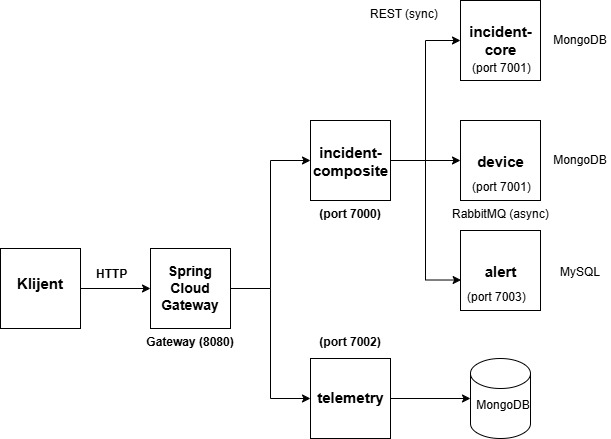

# DIS_I225-2025_Mia_Nedeljkovic-_SmartCity
Mikroservisna platforma za Smart City razvijena korišćenjem Spring Boot i Spring Cloud tehnologija. Sadrži 5+ mikroservisa, Docker kontejnerizaciju, sinhrone/asinhrone komunikacije putem RabbitMQ, CI pipeline. Podložna je proširenjima u vidu monitoringa putem Grafane i mnogobrojnih dodatnih funkcionalnosti u svrhu kreiranja master rada.

Projekat je sproveden kao predmetni zadatak u okviru predmeta **Distribuirani Informacioni Sistemi**. Baziran je na knjizi *„Hands-on Microservices with Spring Boot and Spring Cloud"* (Magnus Larsson), 3. izdanje koja spada u 
redovnu literaturu na prethodno pomenutom predmetu.

## Opis poslovne logike

Sistem modeluje proces prijava i praćenja događaja (u projektu poznatih kao incidents) u gradu koji je pametan grad (set uređaja koji prikupljaju Big Data, konstantno komuniciraju i uče jedan od drugih).
Primer jednog takvog „incidenta" jeste pucanje vodovodne cevi ili pak semafor koji se pokvario. Građani, to jest autori, imaju pravo i moralnu obavezu da prijave incidente u gradu.
Incidenti su u svakom slučaju direktno povezani sa uređajima odnosno senzorima koji prikupljaju podatke sa lica mesta (sa terena) i alarmima koji se generišu na osnovu tih podataka.

## Tok podataka

1. Klijent šalje zahtev na **Gateway** ('localhost:8080')
2. Kada je kreiranje/brisanje incidenata u pitanju, Gateway prosleđuje zahtev za pomenute CRUD aktivnosti ka **incident-composite** servisu
3. **incident-composite** šalje asinhrone poruke putem **RabbitMQ-a** ka incident-core, device i alert servisima (sa pripadajućim redovima: incidents, devices, alerts)
4. Za čitanje odnosno fetch-ovanje podataka (GET request), **incident-composite** sinhrono (RESTfully) poziva sva tri servisa preko Eureka load balancer-a i agregira odgovore u jedinstveni JSON fajl.
5. Što se telemetry servisa tiče, on je nezavisan. Dakle, radi isključivo sinhrono (REST), bez RabbitMQ-a, jer simulira direktan upis senzorskih očitavanja (poznatijih kao IoT push patterns),
koji ne mora da prolazi kroz orkestraciju kompozitnog servisa.

## Servisi



Svi servisi su registrovani na sledeći server/port: Eureka Server (port 8761)

Asinhrona komunikacija odvija se preko: RabbitMQ (port 5672)


## 3. Uputstvo za pokretanje (build / test / deploy)

### Preduslovi

- Java 17
- Docker Desktop (mora biti pokrenut)
- Git

### 3.1. Build (kompajliranje svih servisa)

```bash
git clone https://github.com/mia4444/DIS_I225-2025_Mia_Nedeljkovic_SmartCity.git
cd DIS_I225-2025_Mia_Nedeljkovic_SmartCity
./gradlew build -x test
```

### 3.2. Test (unit + integracioni testovi)

> Docker Desktop mora biti pokrenut — integracioni testovi koriste **Testcontainers**
> (privremeni MongoDB/MySQL kontejneri se automatski podižu i gase za vreme testova).

```bash
./gradlew test
```

Izveštaji testova se generišu u `*/build/reports/tests/test/index.html` za svaki servis.

### 3.3. Deploy / pokretanje celog sistema (produkcioni profil, Docker)

```bash
./gradlew build -x test
docker-compose build
docker-compose up
```

Sistem će biti dostupan na:
- **Gateway (ulazna tačka):** `http://localhost:8080`
- **Eureka dashboard:** `http://localhost:8761`
- **RabbitMQ management:** `http://localhost:15672` (guest/guest)

Za zaustavljanje:

```bash
docker-compose down
```
### 3.4 Primer korišćenja API-ja

**Kreiranje incidenta**
Asinhrono, preko composite servisa

```bash
curl -X POST http://localhost:8080/incident-composite \
  -H "Content-Type: application/json" \
  -d '{"incidentId":1,"name":"Pukla vodovodna cev","weight":1}'
```

**Čitanje incidenta** (sinhrono, agregirani odgovor):

```bash
curl http://localhost:8080/incident-composite/1
```

**Upis telemetrijskog očitavanja** (nezavisan, sinhron servis):

```bash
curl -X POST http://localhost:8080/telemetry \
  -H "Content-Type: application/json" \
  -d '{"deviceId":1,"sensorType":"temperature","value":24,"unit":"C"}'
```

```bash
curl "http://localhost:8080/telemetry?deviceId=1"
```

### 3.5. CI/CD Pipeline

Pipeline je definisan u `.github/workflows/build.yml` i automatski se pokreće na svaki `push`
i `pull request` ka `main` grani. Sastoji se od dve faze:

1. **build-and-test** — kompajlira sve module, pokreće sve unit i integracione testove
   (Testcontainers), čuva izveštaje testova kao artifact
2. **docker-build** — gradi Docker image za svaki servis i validira `docker-compose.yml`
   konfiguraciju (simulira deploy fazu)

Status pipeline-a se može pratiti u **Actions** tabu GitHub repozitorijuma.

---